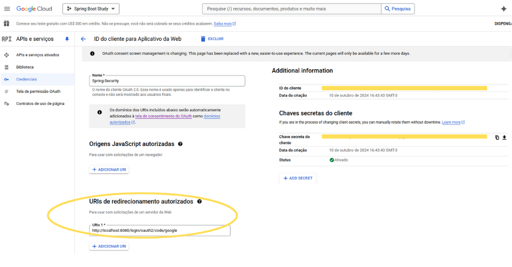
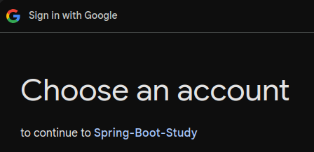
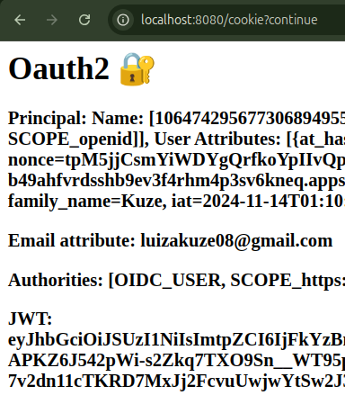
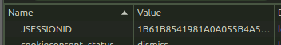
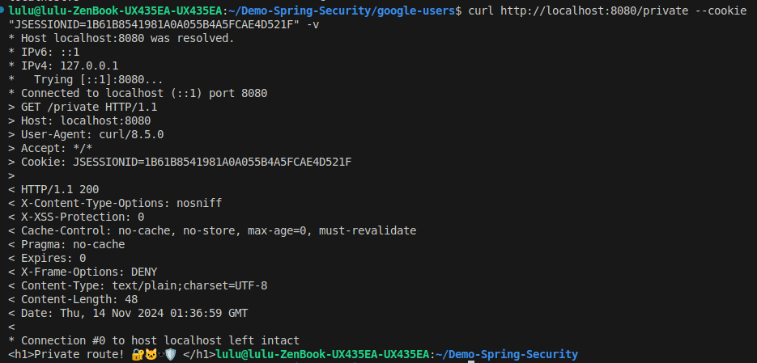
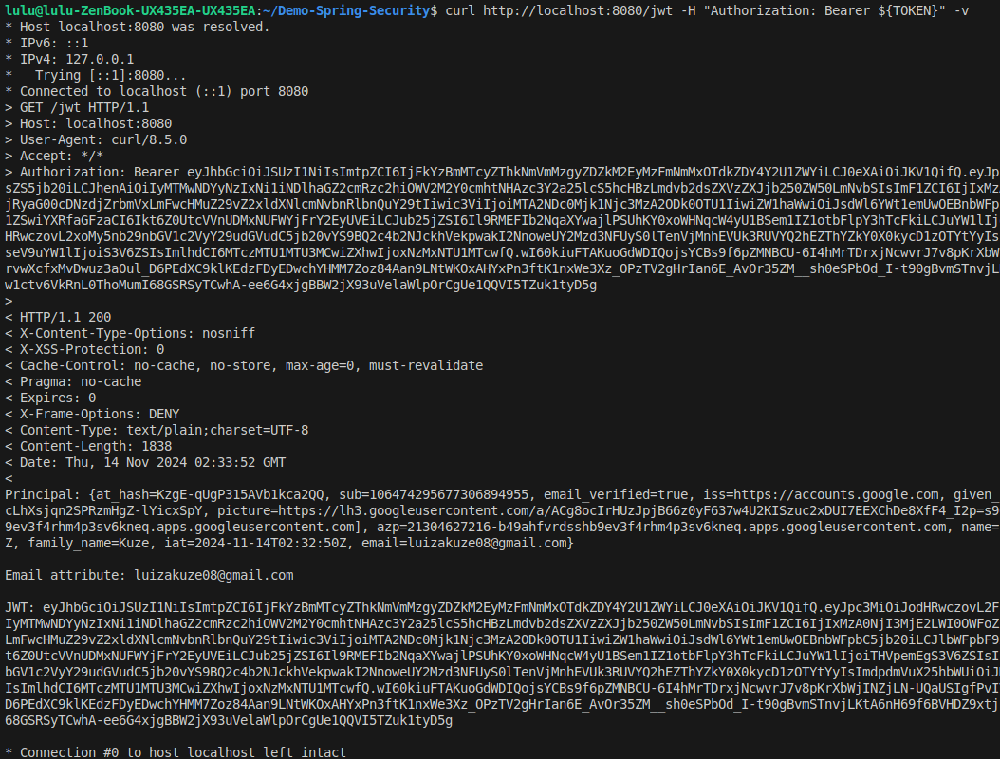

# Google Users 🌐

Este projeto é uma aplicação Spring Boot que demonstra o uso de autenticação e autorização com Spring Security, integrando o Google como provedor de identidade via OAuth 2.0 e OpenID Connect (OIDC).
 
## OAuth2 e OIDC ✨
Mis informações sobre: [notas oauth2 e oidc](./oauth&oidc.md)

## Manual 📝 
### 🔐 1. OAuth2 e Google
Para permitir que os usuários façam login com suas contas do Google, é necessário configurar o Google como provedor de identidade (Authorization Server) e registrar a aplicação como cliente OAuth2. Siga os passos abaixo para configurar o projeto:
1) Acessar o endereço: `https://console.cloud.google.com/apis/credentials`
2) Seguir a sequência: **Criar um projeto** > **Criar credenciais** > **ID do cliente Oauth**
3) Colocar URI de redirecionamento autorizado como: ```http://localhost:8080/login/oauth2/code/google```

	

	### O que é o Client ID e o Client Secret?
	- **Client ID**: Identifica a aplicação cliente no Google. O Authorization Server (Google) usa este ID para reconhecer a aplicação.
	- **Client Secret**: É um segredo gerado pelo Google, conhecido apenas pela aplicação cliente e pelo Google (Authorization Server). Utilizado para provar a identidade da aplicação (cliente) perante ao google (servidor), garantindo que somente aplicações autenticadas possam solicitar um access token.

4. Colocar essas informações no arquivo application.yml
 
### ▶️ 2. Executar a aplicação
Utilizando o Gradle, execute o seguinte comando:
```
./gradlew bootRun
```
### 📍 3. Verificar endpoints
- #### 📍 3.1. Endpoint público: `/public`
	
	
- #### 📍 3.2. Acessar endpoint privado: `/private`
 
	Note que será necessária a autenticação via Google:

	

	Após autenticação, o acesso é permitido:

	

- #### 📍 3.2. Acessar endpoint privado: `/cookie`

	Após autenticação, mostra as seguintes informações:
	- `Principal`: Objeto tipo OidcUser representando o usuário.
	- `Email attribute`: Endereço de email associado ao usuário.
	- `Authorities`: Escopos associados  ao usuário.
	- `JWT`: Próprio token JWT (ID token).

	

## Gerenciamento de Sessão 👤 

O **HTTP** é um protocolo sem estado, sem memória das chamadas anteriores. Como gerenciar o estado de autenticação? Para o usuário uma vez autenticado possa acessar partes protegidas de uma aplicação web sem precisar fazer login repetidamente, é necessária uma estratégia de gerenciamento.

Nesse projeto, foram implementadas duas estratégias de gerenciamento de sessão: **Cookies de Sessão** e **JWT (stateless)**

### 🍪 Cookies de Sessão
- Ao utilizar o serviço como cliente OAuth, no navegador é criado um cookie de sessão. Com a presença desse cookie, é possível verificar se um usuário é válido ou se está autenticado. 
- Para obter o valor desse cookie de sessão, utilizar a ferramenta DevTools. No navagador, pressione F12. O cookie estará em **Application**. Localizar na barra lateral **Cookies** e acessar. O Cookie encontrado terá essa aparência:

	

- No terminal:

	```bash
	curl http://localhost:8080/private --cookie "JSESSIONID=Value" -v
	```
	>Substituir "Value" pelo conteúdo do cookie obtido anteriormente.

	Isso permite verificar o endpoint `/private` diretamente do terminal:

	

	Note que como o usuário está autenticado, a rota foi retornada sem problemas. Porém, caso o usuário não seja válido ou o cookie esteja ausente/inválido, o servidor retorna um erro HTTP 401 (Unauthorized), indicando que o usuário deve se autenticar corretamente antes de acessar o recurso.

### 🗝️ JWT

- Em dispositivos móveis, não se utiliza tanto a ideia de cookie de sessão. Se utiliza mais o JWT nessa questão pois não é necessário armazenar informações sobre sessão do usuário, reduzindo carga no servidor e melhorando escalabilidade.

- Obter o token jwt por meio do endpoint `/cookie` e salvar em uma variável:

	```bash
	TOKEN="minha-jwt"
	```
- Fazer uma requisição se autenticando via terminal com a jwt no endpoint `/jwt`:

	```bash
	curl http://localhost:8080/jwt -H "Authorization: Bearer ${TOKEN}" -v
	``` 

	

	- Token JWT foi utilizado como parâmetro para obter as seguintes informações:

		- `Principal`: Todas as claims contidas no token JWT (ex. "at_hash" que é o hash da access token).
		- `Email attributes`: Exibe a claim de email do usuário.
		- `JWT`: Exibe o valor do token JWT completo.

 
## Dependências 📚   

- [Spring Boot](https://spring.io/projects/spring-boot)  
- [Spring Security](https://spring.io/projects/spring-security)   

## 🔗 Links Úteis  
- https://medium.com/@prashantramnyc/difference-between-session-cookies-vs-jwt-json-web-tokens-for-session-management-4be67d2f066e
- https://auth0.com/docs/get-started/authentication-and-authorization-flow/authorization-code-flow
- https://docs.spring.io/spring-security/site/docs/5.0.x/reference/html/oauth2login-advanced.html

- https://www.youtube.com/watch?v=GhrvZ5nUWNg&t=560s
- https://www.youtube.com/watch?v=UBUNrFtufWo
- https://cursos.alura.com.br/forum/topico-sessao-cookies-e-tokens-284486
- https://www.youtube.com/watch?v=UBUNrFtufWo
- https://www.youtube.com/watch?v=GhrvZ5nUWNg
- https://www.youtube.com/watch?v=M6N7gEZ-IUQ
- https://auth0.com/blog/id-token-access-token-what-is-the-difference/
- https://bkappi.com/webdev/autenticacao-web-entendendo-diferenca-sessions-tokens/
- https://programae.org.br/software/glossario/o-que-e-jwt-json-web-token-e-como-ele-e-usado-em-seguranca-de-software/