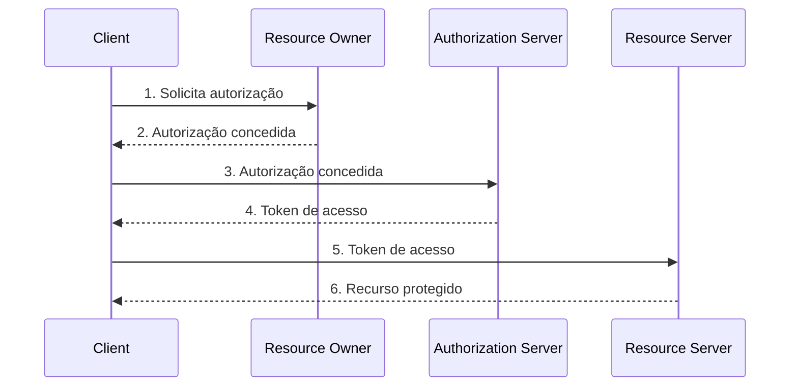
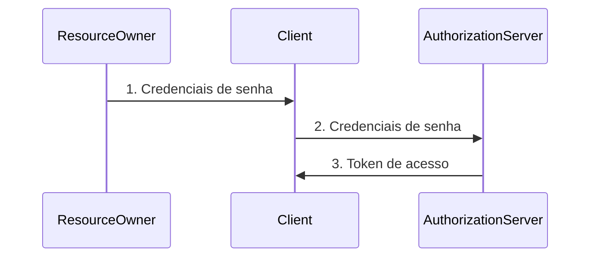
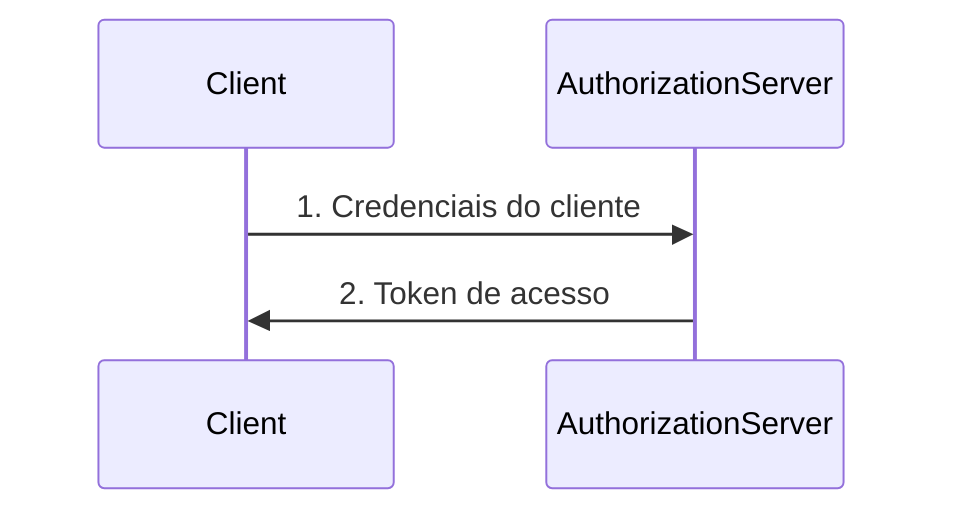
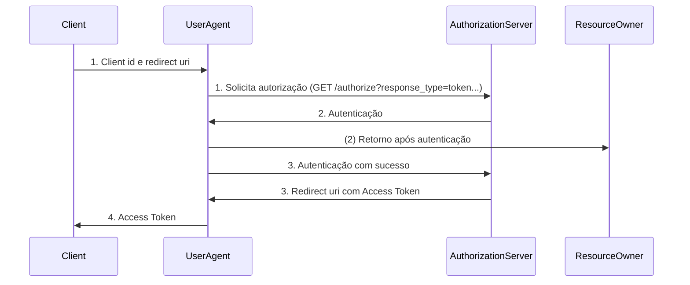

## OAuth 2.0 e OIDC

Minha aplicação precisa logar usuários... O que precisa? Algumas coisas:
1) Armazenar, recuperar e validar credenciais.
2) Segurança.
3) 2FA.
4) Recuperação de senha.

Solução: Implementar tudo ou delegar isso a um terceiro que já tem tudo implementado.

Para delegar isso à um terceiro: OAuth 2.0 e OpenID. São protocolos que dizem quem você é e possibilitam aos provedores que já tem a implementação conceder acesso a recursos.

## OAuth - Autorização

### Papéis 
OAuth: Protocolo que habilita uma aplicação terceira a obter acessso limitado ao serviço HTTP. Aqui entram os papéis do OAuth:

| Resource Owner       | Resource Server         | Authorization Server       | Client                 |
|----------------------|-------------------------|----------------------------|------------------------|
| **Dono do recurso**  | **Onde está o recurso** | **Concede acesso ao recurso** | **Solicita acesso ao recurso** |


- RO: Usuário final, dono do recurso. Acessando a aplicação
- Client: Aplicação, vai falar que precisa autorizar o seu nome. Vai encaminhar o usuário para seu "superior" para ele te conceder os acessos necessários.
- AS: IdP  (Google, Facebook, ..). Você se apresenta para o IdP que já tem suas credenciais, você responde quais credenciais você vai conceder. O AS valida as credenciais e ele retorna o token de acesso ao client.
- RS: Backend. Vê se o token é válido e permite AS retornar o recurso para o usuário.
 


### Tipos de Token
- Access Token: Concede acesso a recursos protegidos e compreendidos pelo RS. Pode ser JWT ou Opaco. 

    - O JWT tem formato JSON e seu conteúdo pode ser lido.
    O formato JSON está em "Encoded" e pode ser lido que nem o "Payload":
    

    - O Opaco não pode ser lido pelos clientes, apenas pelo emissor. Foco preservar dados do usuário

- Refresh Token: Expiram, geralmente é opaco e necessário obter novos tokens sem necessidade de logar novamente. Alguém com esse token, pode gerar inúmeros tokens como esse.

### O que um usuário autenticado pode fazer?
Scopes: Definem os papéis, permissões associadas ao access token. "Uma aplicação está pedindo autorização da sua câmera...", isso se chama Scope.

### Fluxo de Autorização do protocolo OAuth:  Grant Types

| **Password**          | **Client Credentials**         | **Authorization Code**                    | **Implicit**                       |
|-----------------------|--------------------------------|-------------------------------------------|------------------------------------|
| Credenciais do usuário final | Credenciais da aplicação cliente | Credenciais do usuário final e da aplicação cliente | Credenciais do usuário e id da aplicação cliente |

1) **Password**: Clientes super confiáveis. Preferência em evitar isso, usuário informa o seu nome e senha ao cliente. Cliente deve ser MUITO confiável.



2) **Client Credentials**: Service-to-Service. Grande uso, mas muito específico para um serviço se comunicando com outro serviço.



3) **Authorization Code**: SPAs. Single Page Application, aplicação carrega uma página html e atualiza dinamicamente o conteúdo conforme usuário interage com a aplicação.

    Autenticar com as credenciais do cliente, com as credenciais do usuário final (resource owner) e gerar um authorization code intermediário para garantir que quem começou o fluxo de autenticação, termine ele. 

 ```mermaid
 sequenceDiagram
    Client->>UserAgent: 1. Client id e redirect uri
    UserAgent->>AuthorizationServer: 1. Client id e redirect uri
    AuthorizationServer->>UserAgent: 2. Autenticação
    UserAgent->>ResourceOwner: 2. Autenticação
    ResourceOwner->>UserAgent: (2) Retorno após autenticação
    UserAgent->>AuthorizationServer: 3. Solicita Authorization Code
    AuthorizationServer->>UserAgent: 3. Authorization Code
    UserAgent->>Client: 4. Authorization code e redirect uri
    Client->>AuthorizationServer: 5. Access code
 ```

4) **Implicit: SPAs**. Evitar esse fluxo, naõ tem código de autenticação intermediário e nem client secret.
    


### No dia a dia, o uso fica no Authorization Code para SPAs e Client credentials para service-to-service.

## OpenID Connect - Autenticação

- Falamos de autorização, mas não de autenticação até o momento...
- OAuth2 autoriza o usuário a acessar um recurso, enquanto o OpenID dá identidade ao usuário.

### Conceitos
- Acess Token: O que você pode fazer.
- ID Token: Quem é você.
- Endpoints: `/login`, `/token`, `/userinfo`, `/logout`

### Fluxo de Autenticação
- Comum: Apenas autentica usuário e retorna ID Token.
- Híbrido (+usado): Autentica e autoriza, retornando um ID Token e um Acess Token.

## Resumo OAuth 2.0 e OpenID
### OAuth 2.0 é um protocolo de autorização
- **Papéis**
  - Resource Owner, Client, Authorization Server, Resource Server
- **Tokens**
  - Access tokens (JWT vs Opaco)
  - Refresh tokens
- **Scopes**
- **Grant Types**
  - Password, Client Credentials, Authorization Code, Implicit

### OpenID é um protocolo de autenticação
- Extensão do OAuth2
- Focado na identidade do usuário - Id Token
- Endpoints: `/login`, `/token`, `/userinfo`, `/logout`

# Lnks Úteis

- https://www.youtube.com/watch?v=Hg4fj44nmGo
- https://www.youtube.com/watch?v=ZV5yTm4pT8g