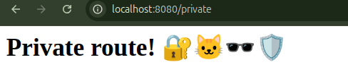
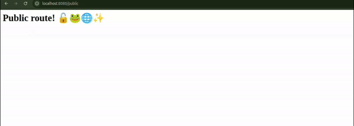

# Own Users 👤

Este projeto é uma aplicação Spring Boot que demonstra o uso de autenticação e autorização utilizando Spring Security. 

## Endpoints 📌

- **/public**: Rota pública acessível por qualquer pessoa, independente de autenticação. Permite que todos acessem o conteúdo sem restrições.
  
    

- **/private**: Rota privada, acessível apenas para usuários autenticados. Exibe uma mensagem exclusiva para usuários autorizados. Está disponível em ambas as configurações de autenticação (Google User e Own Users).

    
 
  >Lembrando que a senha foi definida no `application.properties`!

## Demonstração 🎥 

 
## Dependências 📚   

- [Spring Boot](https://spring.io/projects/spring-boot)  
- [Spring Security](https://spring.io/projects/spring-security)  

## Licença 📜 

Este projeto está licenciado sob a licença MIT.